## How It Works

```mermaid
flowchart LR
    A[Write locally] --> B[Queue to outbox]
    B --> C[Push when online]
    C --> D[Pull server changes]
    D --> E{Conflict?}
    E -- Yes --> F[Resolve — 6 strategies]
    F --> A
    E -- No --> A
```



## Quick Start

::: code-group
```yaml [pubspec.yaml]
dependencies:
  offline_first_sync_drift: ^0.1.2
  offline_first_sync_drift_rest: ^0.1.2
  drift: ^2.26.1

dev_dependencies:
  drift_dev: ^2.26.1
  build_runner: ^2.4.15
```
```dart [Setup]
final transport = RestTransport(
  base: Uri.parse('https://api.example.com'),
  token: () async => 'Bearer ${await getToken()}',
);

final engine = SyncEngine(
  db: database,
  transport: transport,
  tables: [todoSync],
  config: const SyncConfig(
    conflictStrategy: ConflictStrategy.autoPreserve,
  ),
);

// Sync on demand
await engine.sync();
```
```dart [CRUD]
// Read locally — instant, works offline
final todos = await db.select(db.todos).get();

// Write + enqueue in one call (syncWriter sugar)
// Sugar for: db.into(table).insert(...) + db.enqueue(UpsertOp.create(...))
final writer = db.syncWriter().forTable(todoSync);
await writer.insertAndEnqueue(todo);

// Update: read existing, modify, write back
final existing = await (db.select(db.todos)
  ..where((t) => t.id.equals('todo-1'))).getSingle();
final updated = existing.copyWith(title: 'New title');
await writer.replaceAndEnqueue(
  updated,
  baseUpdatedAt: existing.updatedAt,
  changedFields: {'title'},
);

// Push & pull when ready
await engine.sync();
```
:::

## Conflict Resolution

The killer feature: **field-level change tracking + hybrid resolution**.

```
Local change:  {mood: 5, notes: "My notes"}   (changedFields: {mood, notes})
Server state:  {mood: 3, energy: 7, notes: "Old"}
───────────────────────────────────────────────
autoPreserve:  {mood: 5, energy: 7, notes: "My notes"}
               ↑ local   ↑ server   ↑ local
```

Only the fields you changed overwrite the server. Fields modified by other clients are preserved.

