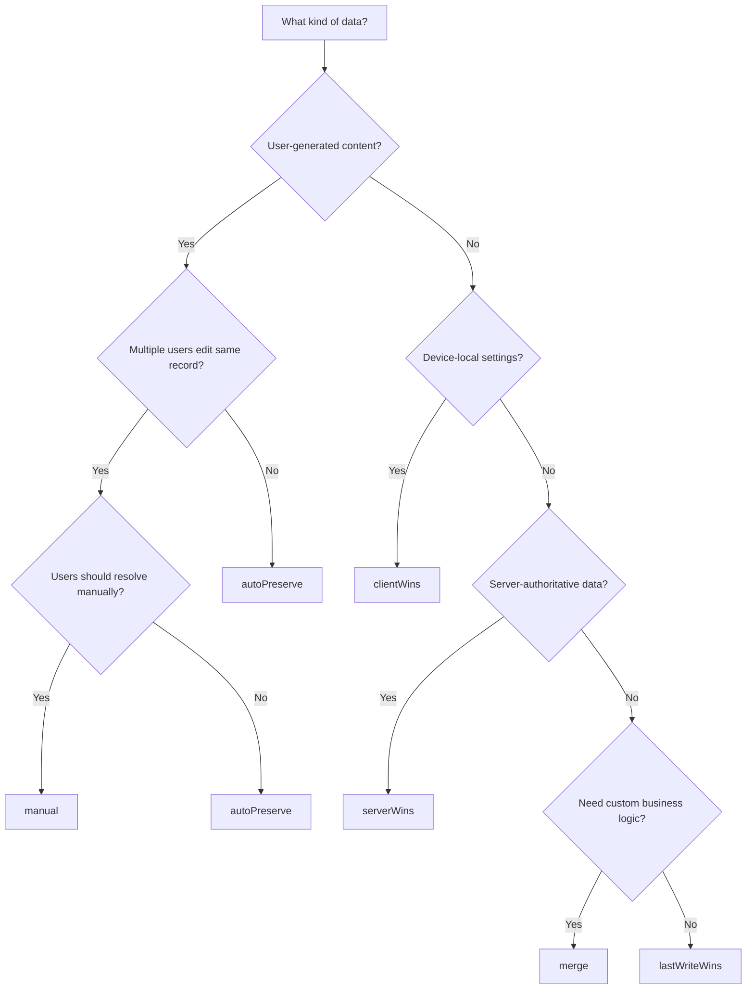

# Conflict Resolution

Conflicts are inevitable in offline-first systems. Two devices edit the same record, both go online, and the server has to figure out whose version wins. This library handles conflicts **on the client side** with six ready-to-use strategies — no backend merge logic required.

This guide covers how to choose a strategy, implement it, and handle edge cases.

## How Conflicts Happen

A conflict occurs when a record was modified both locally and on the server since the last sync.

```
Timeline:
  t0  Client pulls record {id: "1", title: "Buy milk", updatedAt: t0}
  t1  Client edits locally → {title: "Buy oat milk"} + enqueue with baseUpdatedAt: t0
  t2  Another device pushes → server now has {title: "Buy almond milk", updatedAt: t2}
  t3  First client calls sync() → pushes {title: "Buy oat milk", _baseUpdatedAt: t0}
  t4  Server sees _baseUpdatedAt (t0) < current updatedAt (t2) → responds 409
```

What happens after 409:

```
1. Client → PUT /items/1  {data, _baseUpdatedAt: t0}
2. Server compares _baseUpdatedAt with its current updatedAt
3. t0 < t2 → 409 + {current: {title: "Buy almond milk", updatedAt: t2}}
4. Client receives 409, invokes the chosen ConflictStrategy
5. Strategy produces a ConflictResolution (accept server, client, merge, defer, discard)
6. If resolution requires a write → Client sends PUT with X-Force-Update: true
7. Server accepts the force-update (or rejects if business rules are violated)
```

The server always has the final say — it can reject a force-update. But you don't write merge logic on the backend — just detect the conflict (`409`) and validate the result.

## Choosing a Strategy

### Decision Tree



### Quick Reference

| Strategy | Best for | Risk |
|----------|----------|------|
| `autoPreserve` | Multi-user editing, forms, CRM | None if `changedFields` is tracked correctly |
| `serverWins` | Server-authoritative data, prices, permissions | Local changes are silently discarded |
| `clientWins` | Device settings, user preferences | Other clients' changes are overwritten |
| `lastWriteWins` | Simple apps, single-user multi-device | Depends on clock accuracy |
| `merge` | Domain-specific logic, calculated fields | You must handle all edge cases yourself |
| `manual` | Collaborative editing, critical data | Requires UI, user must act |

### By App Type

| App type | Recommended | Why |
|----------|------------|-----|
| Notes / todo app | `autoPreserve` | Users edit different fields; merge preserves both |
| CRM / forms | `autoPreserve` + `changedFields` | Sales reps edit different sections of a contact |
| Settings sync | `clientWins` | User's device preferences should always win |
| E-commerce catalog | `serverWins` | Prices and stock come from the server |
| Collaborative documents | `manual` | Users should see diffs and choose |
| Health / mood tracker | `autoPreserve` | Personal data, rarely conflicts |
| Analytics events | `serverWins` | Append-only, conflicts are rare |

## Strategies in Practice

### autoPreserve — Smart Merge (Default)

The recommended strategy for most apps. Merges local and server data field by field, preserving changes from both sides.

```dart
final engine = SyncEngine(
  db: db,
  transport: transport,
  tables: [todoSync],
  config: SyncConfig(
    conflictStrategy: ConflictStrategy.autoPreserve,
  ),
);
```

How the merge works:

```
Local data:    {title: "Buy oat milk", priority: 1}
changedFields: {title}

Server data:   {title: "Buy almond milk", priority: 5, tags: ["grocery"]}

autoPreserve starts with server data, then applies only changedFields from local:

Result:        {title: "Buy oat milk", priority: 5, tags: ["grocery"]}
               ↑ local (in changedFields)  ↑ server       ↑ server
```

Merge rules:
1. Start with server data as the base
2. Apply local changes — **only** fields listed in `changedFields`
3. If `changedFields` is empty or null — apply ALL non-system local fields (behaves like `clientWins`)
4. Lists are merged (union, no duplicates)
5. Nested objects are merged recursively
6. System fields (`id`, `updatedAt`, `deletedAt`) always come from the server

**Key rule:** Always pass `changedFields` when updating. Without it, `autoPreserve` applies all local fields, which may overwrite server changes you didn't intend to touch.

```dart
// Good — precise merge, only title and notes overwrite server
await writer.replaceAndEnqueue(
  updated,
  baseUpdatedAt: existing.updatedAt,
  changedFields: {'title', 'notes'},
);

// Also good — changedFields computed automatically by comparing before/after
await writer.replaceAndEnqueueDiff(
  before: existing,
  after: updated,
  baseUpdatedAt: existing.updatedAt,
);

// Bad — no changedFields, ALL local fields overwrite server
await writer.replaceAndEnqueue(
  updated,
  baseUpdatedAt: existing.updatedAt,
);
```

### serverWins — Server is Truth

The simplest strategy. On conflict, the server version replaces local data. The local operation is dropped from the outbox.

```dart
config: SyncConfig(
  conflictStrategy: ConflictStrategy.serverWins,
),
```

```
Local:  {title: "My edit", priority: 1}
Server: {title: "Admin edit", priority: 5}
Result: {title: "Admin edit", priority: 5}  ← server data applied to local DB
```

Use when:
- Data is managed by admins or backend systems
- Local edits are "suggestions" that can be discarded
- You want zero complexity

Risk: **User's changes are silently lost.** Consider showing a notification when this happens (listen for `ConflictResolvedEvent`).

### clientWins — User is Always Right

Local data overwrites the server via force-update. No merge, no questions asked.

```dart
config: SyncConfig(
  conflictStrategy: ConflictStrategy.clientWins,
),
```

```
Local:  {theme: "dark", fontSize: 16}
Server: {theme: "light", fontSize: 14}
Result: {theme: "dark", fontSize: 16}  ← force-pushed to server
```

Use when:
- Device-specific settings (theme, layout, notifications)
- User preferences that shouldn't sync from other devices

Risk: **Other clients' changes are overwritten.** Only use for data that is inherently per-device.

### lastWriteWins — Timestamp Decides

Compares timestamps. The newer version wins — either local is force-pushed or server data is accepted.

```dart
config: SyncConfig(
  conflictStrategy: ConflictStrategy.lastWriteWins,
),
```

```
Local:  {title: "Edit at 14:05", updatedAt: 2025-01-15T14:05:00Z}
Server: {title: "Edit at 14:03", updatedAt: 2025-01-15T14:03:00Z}
Result: {title: "Edit at 14:05"}  ← local wins (14:05 > 14:03)
```

The comparison uses `conflict.localTimestamp` (from `DateTime.now()` at enqueue time) vs `conflict.serverTimestamp` (server's `updatedAt`). The winner depends solely on these two timestamps — no field-level merging happens.

Use when:
- Single-user, multi-device (phone + tablet)
- Simple apps where "most recent edit" is good enough

Risk: **Clock skew.** If one device has an incorrect clock, it always wins (or always loses). The server sets `updatedAt`, so the risk only applies to local timestamps before the first push.

### merge — Custom Logic

Provide a synchronous function that receives both data maps and returns the merged result.

```dart
config: SyncConfig(
  conflictStrategy: ConflictStrategy.merge,
  mergeFunction: (local, server) {
    // Custom: keep server title, sum quantities
    return {
      ...server,
      'quantity': (local['quantity'] as int) + (server['quantity'] as int),
    };
  },
),
```

The typedef:

```dart
typedef MergeFunction = Map<String, Object?> Function(
  Map<String, Object?> local,
  Map<String, Object?> server,
);
```

Built-in helpers in `ConflictUtils`:

```dart
// Local non-null fields override server (flat, nulls are skipped)
ConflictUtils.defaultMerge(local, server);

// Recursive merge for nested objects
ConflictUtils.deepMerge(local, server);

// Smart merge respecting changedFields
final result = ConflictUtils.preservingMerge(
  local, server,
  changedFields: {'title', 'notes'},
);
// result.data         — merged Map
// result.localFields  — Set<String> of fields taken from local
// result.serverFields — Set<String> of fields taken from server
```

### manual — User Decides

The most powerful strategy. An async callback receives the `Conflict` object and returns a `ConflictResolution`.

```dart
config: SyncConfig(
  conflictStrategy: ConflictStrategy.manual,
  conflictResolver: (conflict) async {
    final choice = await showConflictDialog(
      localData: conflict.localData,
      serverData: conflict.serverData,
      entityKind: conflict.kind,
      entityId: conflict.entityId,
      changedFields: conflict.changedFields,
    );

    return switch (choice) {
      'keep_mine'   => AcceptClient(),
      'keep_theirs' => AcceptServer(),
      'merge'       => AcceptMerged(mergedData, mergeInfo: MergeInfo(
                          localFields: {'title'},
                          serverFields: {'priority'},
                        )),
      'later'       => DeferResolution(),
      _             => DiscardOperation(),
    };
  },
),
```

The `Conflict` object:

| Field | Type | Description |
|-------|------|-------------|
| `kind` | `String` | Entity kind (e.g., `'todos'`) |
| `entityId` | `String` | Record ID |
| `opId` | `String` | Outbox operation ID |
| `localData` | `Map<String, Object?>` | Local version of the record |
| `serverData` | `Map<String, Object?>` | Current server version |
| `localTimestamp` | `DateTime` | When the client made the change |
| `serverTimestamp` | `DateTime` | Server's `updatedAt` |
| `serverVersion` | `String?` | ETag or version string (if provided) |
| `changedFields` | `Set<String>?` | Fields the client changed |

Resolution options:

| Resolution | What happens |
|------------|-------------|
| `AcceptServer()` | Discard local changes, apply server version to local DB |
| `AcceptClient()` | Force-push local version to server |
| `AcceptMerged(data)` | Force-push custom merged data; optionally pass `mergeInfo` |
| `DeferResolution()` | Keep in outbox, retry on next `sync()` |
| `DiscardOperation()` | Remove from outbox, don't touch DB or server |

## Per-Table Configuration

Different data needs different strategies. Override per table via `tableConflictConfigs`:

```dart
final engine = SyncEngine(
  db: db,
  transport: transport,
  tables: [todoSync, settingsSync, analyticsSync],
  config: SyncConfig(
    conflictStrategy: ConflictStrategy.autoPreserve,  // Global default
  ),
  tableConflictConfigs: {
    'user_settings': TableConflictConfig(
      strategy: ConflictStrategy.clientWins,
    ),
    'shared_documents': TableConflictConfig(
      strategy: ConflictStrategy.manual,
      resolver: (conflict) async => showDocConflictDialog(conflict),
    ),
    'analytics_events': TableConflictConfig(
      strategy: ConflictStrategy.serverWins,
    ),
  },
);
```

`TableConflictConfig` fields:

| Field | Type | Description |
|-------|------|-------------|
| `strategy` | `ConflictStrategy?` | Override global strategy |
| `resolver` | `ConflictResolver?` | Override global resolver (for `manual`) |
| `mergeFunction` | `MergeFunction?` | Override global merge (for `merge`) |
| `timestampField` | `String` | Reserved for future use (default: `'updatedAt'`) |

Per-table config takes priority. Tables without an entry use the global `conflictStrategy`.

## Building Conflict Resolution UI

When using `manual` strategy, you need a UI for users to resolve conflicts.

### Diff View Pattern

Show the user what changed on each side:

```dart
Future<ConflictResolution> showConflictDialog(Conflict conflict) async {
  final local = conflict.localData;
  final server = conflict.serverData;

  // Find fields that differ
  final diffFields = <String>{};
  for (final key in {...local.keys, ...server.keys}) {
    if (local[key] != server[key]) {
      diffFields.add(key);
    }
  }

  final result = await showDialog<String>(
    context: context,
    barrierDismissible: false,
    builder: (_) => AlertDialog(
      title: Text('Conflict in ${conflict.kind}'),
      content: Column(
        mainAxisSize: MainAxisSize.min,
        children: [
          for (final field in diffFields)
            ListTile(
              title: Text(field),
              subtitle: Text('Yours: ${local[field]}\nServer: ${server[field]}'),
            ),
        ],
      ),
      actions: [
        TextButton(
          onPressed: () => Navigator.pop(context, 'mine'),
          child: const Text('Keep Mine'),
        ),
        TextButton(
          onPressed: () => Navigator.pop(context, 'theirs'),
          child: const Text('Keep Theirs'),
        ),
        TextButton(
          onPressed: () => Navigator.pop(context, 'later'),
          child: const Text('Decide Later'),
        ),
      ],
    ),
  );

  return switch (result) {
    'mine'   => AcceptClient(),
    'theirs' => AcceptServer(),
    'later'  => DeferResolution(),
    _        => DeferResolution(),
  };
}
```

### Silent Auto-Merge with Notification

For non-critical conflicts, resolve automatically but let the user know:

```dart
conflictResolver: (conflict) async {
  // Auto-merge using preservingMerge
  final result = ConflictUtils.preservingMerge(
    conflict.localData,
    conflict.serverData,
    changedFields: conflict.changedFields,
  );

  // Notify UI (e.g., via a stream or state management)
  _conflictNotifications.add(
    'Merged ${conflict.kind} "${conflict.entityId}": '
    '${result.localFields.length} local + '
    '${result.serverFields.length} server fields',
  );

  return AcceptMerged(
    result.data,
    mergeInfo: MergeInfo(
      localFields: result.localFields,
      serverFields: result.serverFields,
    ),
  );
},
```

### Defer and Retry

`DeferResolution()` keeps the operation in the outbox. On the next `sync()`, the push is attempted again, the server returns 409 again, and the resolver is called once more. Use this when:

- The user is in the middle of editing and shouldn't be interrupted
- The app is in the background and can't show a dialog
- You want to present all conflicts in a batch later

## Monitoring Conflicts

### Events

Subscribe to conflict events for logging, analytics, or UI indicators:

```dart
engine.events.listen((event) {
  switch (event) {
    case ConflictDetectedEvent(:final conflict, :final strategy):
      log.info('Conflict detected: ${conflict.kind}/${conflict.entityId}, '
          'strategy: $strategy');

    case ConflictResolvedEvent(:final conflict, :final resolution, :final resultData):
      log.info('Resolved ${conflict.entityId}: ${resolution.runtimeType}');

    case ConflictUnresolvedEvent(:final conflict, :final reason):
      log.warning('Unresolved ${conflict.entityId}: $reason');

    case DataMergedEvent(:final kind, :final entityId, :final localFields, :final serverFields, :final mergedData):
      log.info('Merged $kind/$entityId: '
          '${localFields.length} local + ${serverFields.length} server fields, '
          '${mergedData.length} total keys');

    default:
      break;
  }
});
```

| Event | When |
|-------|------|
| `ConflictDetectedEvent` | Server returned 409, before resolution |
| `ConflictResolvedEvent` | Strategy produced a resolution |
| `ConflictUnresolvedEvent` | Resolution failed (e.g., resolver threw an exception) |
| `DataMergedEvent` | `autoPreserve` or `merge` produced a merged result |

### Stats

After each sync, check conflict counters:

```dart
final stats = await engine.sync();
if (stats.conflicts > 0) {
  log.info('Conflicts: ${stats.conflicts}, '
      'resolved: ${stats.conflictsResolved}, '
      'unresolved: ${stats.conflicts - stats.conflictsResolved}');
}
```

`SyncStats` conflict fields:

| Field | Type | Description |
|-------|------|-------------|
| `conflicts` | `int` | Total conflicts detected during this sync |
| `conflictsResolved` | `int` | Conflicts successfully resolved |

### Diagnosing High Conflict Rates

| Symptom | Likely cause | Fix |
|---------|-------------|-----|
| Conflicts on every sync | `baseUpdatedAt` not passed on update | Always pass `baseUpdatedAt` from the last-known record |
| Same field conflicts repeatedly | Multiple users editing the same field concurrently | Use `autoPreserve` with `changedFields` to merge non-overlapping edits |
| Conflicts after app re-install | Cursors reset, full re-pull causes mismatches | Use `fullResync()` for a clean re-sync |
| Conflicts on newly created records | Duplicate IDs across devices | Use UUID v4 for IDs |
| Cascading conflicts (resolved → 409 again) | Another client pushed between resolution and force-push | Increase `maxConflictRetries` |

## Edge Cases and Pitfalls

### Always Pass baseUpdatedAt on Updates

Without `baseUpdatedAt`, the server can't detect conflicts — every push succeeds, silently overwriting other clients' changes:

```dart
// Bad — server has no way to detect a conflict
await db.enqueue(UpsertOp.create(
  kind: 'todo',
  id: todo.id,
  payloadJson: todo.toJson(),
));

// Good — server compares baseUpdatedAt with its current updatedAt
await db.enqueue(UpsertOp.create(
  kind: 'todo',
  id: todo.id,
  payloadJson: todo.toJson(),
  baseUpdatedAt: todo.updatedAt,
  changedFields: {'title'},
));
```

Note: `baseUpdatedAt` is only needed for **updates**. For new records (creates), omit it — there's nothing to conflict with.

### Cascading Conflicts and Retries

A force-push can trigger another 409 if a third client pushed in between:

```
Client A pushes → 409 → resolves → force-push → 409 again (Client C pushed)
```

The library retries automatically up to `maxConflictRetries` (default: 3). Each retry re-fetches the current server state and re-runs the strategy:

```dart
config: SyncConfig(
  maxConflictRetries: 5,
  conflictRetryDelay: Duration(milliseconds: 500),
),
```

If retries are exhausted, the operation stays in the outbox for the next `sync()`. You can also choose to skip stuck operations:

```dart
config: SyncConfig(
  skipConflictingOps: true,  // Skip and continue with other operations
),
```

### Clock Skew with lastWriteWins

Device clocks can differ by minutes or hours. Mitigations:

- The server sets `updatedAt` on write, not the client — so server timestamps are reliable
- The risk is in the **local** timestamp (`localTimestamp` in `Conflict`), which comes from `DateTime.now()` at enqueue time
- For `lastWriteWins`, the comparison uses server's `updatedAt` vs client's `baseUpdatedAt` — both are server-originated, so clock skew is minimal in practice

### Conflicts During Long Offline Periods

While offline, the user may edit a record multiple times. The outbox stores each operation. On sync:

1. Operations are pushed in order
2. The first push may conflict (server changed the record)
3. After resolution, subsequent pushes for the same record may also conflict
4. Each conflict goes through the strategy independently

Optimization: Use `replaceAndEnqueueDiff` which replaces the previous outbox entry for the same record, effectively collapsing multiple edits into one operation with the combined `changedFields`.

## What's Next

- **[Advanced Cache](./advanced-cache.md)** — full API reference for `ConflictService`, `ConflictResolver`, resolution types
- **[Testing](./testing.md)** — writing tests for each conflict strategy with mock transports
- **[Backend and Transport](./backend-transport.md)** — implementing 409 detection and `X-Force-Update` on the server
- **[Events and Exceptions](./events-exceptions.md)** — complete event type reference
